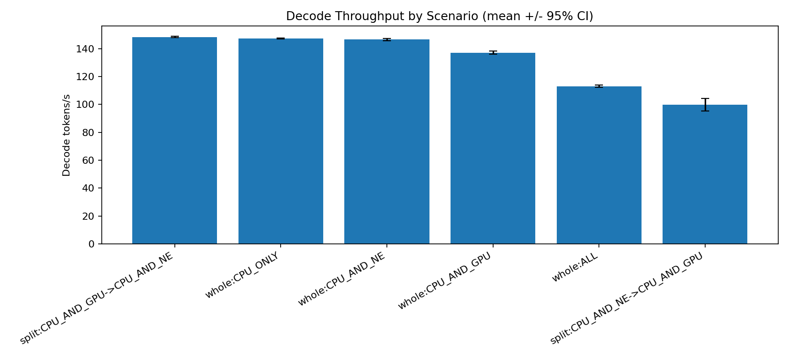
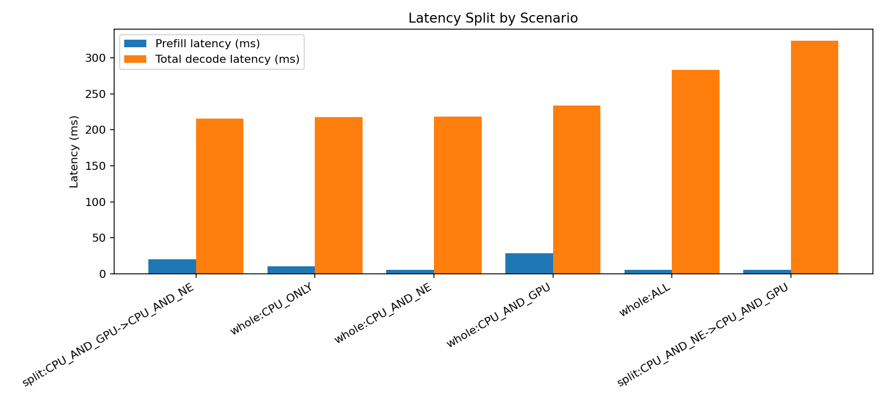
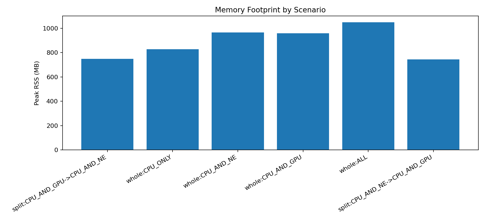

# m3_llm_affinity

Small, reproducible Core ML experiment suite for one model class only: decoder-only language models (GPT-style), targeted at Apple Silicon macOS.

Default setup is intentionally small:
- Model: `openai-community/gpt2`
- Context length: `64`
- Batch size: `1`

## What This Measures

1. Whole-model compute units:
- `CPU_ONLY`
- `CPU_AND_GPU`
- `CPU_AND_NE`
- `ALL`

2. Stage split compute units:
- Prefill and decode loaded with different compute units.

3. MLComputePlan op-level affinity:
- Preferred/supported devices per operation.
- Estimated per-op cost.

4. Performance metrics:
- Prefill latency
- Decode latency statistics and tokens/s
- Effective TFLOPS (approximate FLOP model)
- Peak RSS memory

## Determinism and Scope

- Tokenizer time is excluded.
- Prompt tokens are generated directly as deterministic integer IDs (`seed` in config).
- Prefill/decode use fixed shapes with a sliding-window KV-cache approximation.
- This suite is for hardware affinity behavior, not text quality.

## Project Layout

- `configs/default.yaml`
- `scripts/00_env_check.py`
- `scripts/01_export_torch.py`
- `scripts/02_convert_coreml.py`
- `scripts/03_bench.py`
- `scripts/04_computeplan_dump.py`
- `scripts/05_flops.py`
- `scripts/06_optional_powermetrics_instructions.md`
- `scripts/07_analyze_results.py`
- `models/` (generated)
- `artifacts/` (generated)
- `results/` (generated)
- `reports/` (generated)

## Exact Commands

```bash
make setup
make convert
make bench
make plan
make analyze
```

Single-command setup and run:

```bash
make setup && make convert && make bench && make plan && make analyze
```

## Make Targets

- `make setup`
  - creates `.venv`
  - installs pinned dependencies from `requirements.txt`

- `make convert`
  - runs env check
  - exports TorchScript wrappers
  - converts to Core ML ML Program models
  - validates one CPU-only predict per model

- `make bench`
  - whole mode across all configured compute units
  - split mode for:
    - prefill `CPU_AND_NE`, decode `CPU_AND_GPU`
    - prefill `CPU_AND_GPU`, decode `CPU_AND_NE`

- `make plan`
  - compiles `.mlpackage` to `.mlmodelc`
  - dumps compute-plan CSVs and summary JSON
  - tries `xcrun coremlc compile` first and falls back to `coremltools.utils.compile_model` if `coremlc` is unavailable

- `make analyze`
  - aggregates latest benchmark JSONL files
  - generates plots and a compact analysis summary

- `make clean`
  - removes generated artifacts and venv

## Expected Generated Files

After `make convert`:
- `artifacts/torch/prefill.pt`
- `artifacts/torch/decode.pt`
- `artifacts/model_meta.json`
- `models/prefill.mlpackage`
- `models/decode.mlpackage`

After `make bench`:
- `results/<timestamp>_bench.jsonl`

After `make plan`:
- `artifacts/compiled/prefill.mlmodelc`
- `artifacts/compiled/decode.mlmodelc`
- `reports/computeplan_prefill.csv`
- `reports/computeplan_decode.csv`
- `reports/computeplan_summary.json`

After `make analyze`:
- `reports/analysis/latest_summary.csv`
- `reports/analysis/latest_summary.md`
- `reports/analysis/figures/decode_tokens_per_sec.png`
- `reports/analysis/figures/latency_breakdown.png`
- `reports/analysis/figures/peak_rss_mb.png`

## Result Format (Benchmark JSONL)

Each line is one run record, including:
- `model_id`, `context_len`, `prefill_len`, `gen_tokens`
- `mode`, `prefill_compute_units`, `decode_compute_units`
- `prefill_latency_ms`
- `decode_step_latency_ms_stats` (`mean`, `median`, `p95`)
- `total_decode_latency_ms`
- `tokens_per_sec`
- `effective_TFLOPS_prefill`, `effective_TFLOPS_decode`
- `peak_rss_mb`
- `status` and `errors` if failures occur

## Interpreting CPU_AND_NE

`CPU_AND_NE` may:
- compile and run,
- partially fall back,
- or fail for specific models/shapes.

This suite treats those outcomes as data. Failures are captured in JSONL and the run continues with other configurations.

## Experiment Goal and Design

Goal: isolate how Core ML hardware affinity behaves for one decoder-only model class on Apple M3, across runtime compute-unit choices and stage splits.

Design choices:
- One model class only: causal decoder-only (`openai-community/gpt2` by default).
- Static-shape inference to reduce compiler/runtime variability:
  - prefill length fixed to `context_len - 1`
  - decode uses fixed `(1,1)` token input and fixed-shape KV cache tensors
  - sliding-window KV truncation keeps decode shapes constant each step
- Deterministic prompt tokens from a fixed RNG seed; tokenizer cost is excluded.
- Per-run metrics capture:
  - prefill latency
  - decode throughput and step latency stats
  - effective TFLOPS from the same FLOP model across all scenarios
  - peak RSS
- Device-affinity introspection is done separately with `MLComputePlan` op-level preferred/supported device dumps.

## Latest Analysis (March 1, 2026)

Source files:
- `results/20260301_002348_bench.jsonl` (whole mode)
- `results/20260301_002431_bench.jsonl` (split NE->GPU)
- `results/20260301_002445_bench.jsonl` (split GPU->NE)

Aggregated (20 runs/scenario):

| Scenario | Prefill Latency ms (mean) | Total Decode ms (mean) | Decode tok/s (mean) | Decode tok/s 95% CI |
| --- | ---: | ---: | ---: | ---: |
| split: CPU_AND_GPU -> CPU_AND_NE | 20.080 | 215.856 | 148.254 | +/- 0.467 |
| whole: CPU_ONLY | 10.397 | 217.437 | 147.173 | +/- 0.328 |
| whole: CPU_AND_NE | 5.418 | 218.368 | 146.564 | +/- 0.807 |
| whole: CPU_AND_GPU | 28.289 | 233.475 | 137.101 | +/- 1.065 |
| whole: ALL | 5.235 | 283.212 | 113.014 | +/- 0.750 |
| split: CPU_AND_NE -> CPU_AND_GPU | 5.225 | 323.491 | 99.876 | +/- 4.496 |

### Graphs

Decode throughput:



Latency breakdown:



Peak RSS:



## Higher-Level Results

- For this small GPT-2 setup (`context_len=64`, `gen_tokens=32`), decode-stage placement dominates end-to-end throughput more than prefill speed.
- Best throughput came from `split: CPU_AND_GPU -> CPU_AND_NE` (decode on NE), only slightly above `whole: CPU_ONLY` and `whole: CPU_AND_NE`.
- Fast prefill alone is not enough: `split: CPU_AND_NE -> CPU_AND_GPU` has fast prefill but worst decode throughput.
- `whole: ALL` underperformed materially versus targeted CU settings, indicating extra scheduling/fallback overhead for this workload size.
- Compute-plan evidence aligns with stage behavior:
  - prefill includes many NE-preferred ops (346)
  - decode includes many GPU-preferred ops (423)
  - but measured decode throughput still favored NE/CPU placements for this exact model and shape regime.

## Optional Power Logging

See `scripts/06_optional_powermetrics_instructions.md` for manual `powermetrics` / `asitop` usage.
